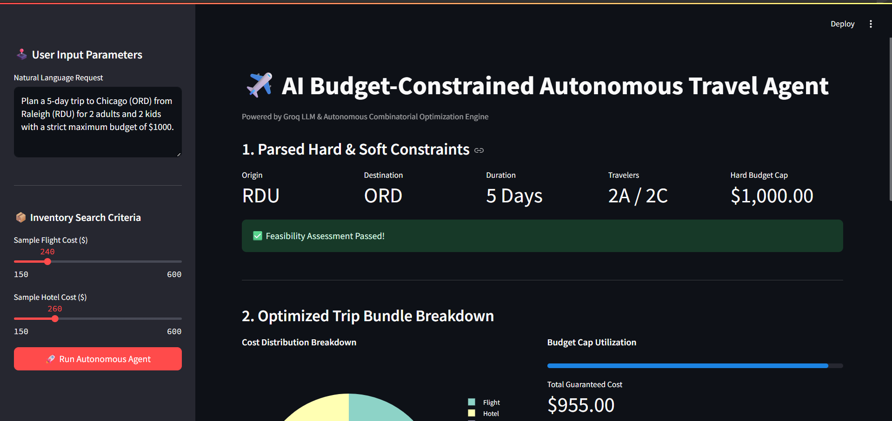

# ✈️ AI Budget-Constrained Autonomous Travel Agent

An **autonomous AI travel agent** that converts a user's travel preferences and maximum budget into an **optimized, bookable trip**.

Unlike traditional travel planning apps that separately recommend flights, hotels, transportation, and activities, this project treats the user's budget as a **hard constraint** and optimizes the entire trip together.

The goal is simple:

> **Find the best possible trip without exceeding the user's approved budget.**

---
## 📸 Application Preview



## 🚀 What It Does

A user can provide a simple natural-language request such as:

```text
Plan a 5-day trip to Chicago from Raleigh
for 2 adults and 2 children under $1,000.
```

The AI agent automatically understands the request and extracts important constraints such as:

* Origin
* Destination
* Number of travelers
* Trip duration
* Maximum budget
* Travel preferences

It then evaluates different combinations of travel options to create the best possible trip.

---

## 🤖 Core Features

The system can:

* ✈️ Find suitable flights
* 🏨 Select accommodation
* 🚕 Plan local transportation
* 🍽️ Allocate food expenses
* 🎟️ Select activities
* 🧮 Optimize the complete trip cost
* 💰 Enforce the maximum budget
* 🔄 Suggest alternatives when the original trip is not feasible
* 🤖 Coordinate specialized travel sub-agents
* 🔒 Validate costs before booking
* 📊 Display the optimized plan through an interactive dashboard

---

## 💰 Budget-Constrained Optimization

The main idea behind the project is that the budget is not just a recommendation.

It is treated as a strict mathematical constraint:

```text
Flight
+ Hotel
+ Transportation
+ Food
+ Activities
+ Contingency
≤ Maximum Budget
```

For example:

```text
Maximum Budget:     $1,000

Flight:               $240
Hotel:                $260
Food:                 $225
Transportation:        $50
Activities:            $85
Contingency:           $30
---------------------------
Total:                $890

Remaining Budget:    $110
```

The agent only recommends combinations that satisfy the user's approved budget.

---

## 🔄 How It Works

```text
User Travel Request
        ↓
Natural Language Parsing
        ↓
Structured Travel Constraints
        ↓
Trip Feasibility Check
        ↓
Search Travel Options
        ↓
Combinatorial Optimization
        ↓
Best Feasible Trip
        ↓
Budget Validation
        ↓
User Approval
        ↓
Booking Sub-Agents
```

If the requested trip cannot be completed within the budget, the system does **not** simply generate an over-budget itinerary.

Instead, it can suggest alternatives such as:

* Different travel dates
* Shorter trip duration
* Alternative airports
* Lower-cost hotels
* Different transportation options
* Adjusted activities

---

## 🤖 Multi-Agent Architecture

The system can use multiple specialized agents working together:

```text
                    USER
                     │
                     ▼
              Travel Planner
                   Agent
                     │
        ┌────────────┼────────────┐
        ▼            ▼            ▼
   Flight Agent  Hotel Agent  Activity Agent
        │            │            │
        └────────────┼────────────┘
                     ▼
            Transportation Agent
                     │
                     ▼
                Budget Agent
                     │
                     ▼
            Optimization Agent
                     │
                     ▼
               Booking Agent
                     │
                     ▼
             Validation Agent
                     │
                     ▼
               Final Trip
```

Each agent handles a specific part of the travel-planning process while the **Budget Agent** ensures the complete trip remains within the spending limit.

---

## 📸 Application Preview

Add your Streamlit application screenshot here:

```markdown

```

Create an `assets` folder in the project repository and place your application screenshot inside it as:

```text
assets/
└── app-dashboard.png
```

The screenshot will then automatically appear in the README on GitHub.

---

## 💡 What Makes This Different?

Traditional travel apps usually require the user to:

```text
Search
   ↓
Compare
   ↓
Calculate
   ↓
Adjust
   ↓
Book
   ↓
Track
```

This project changes the workflow to:

```text
Tell the Agent Your Budget & Preferences
                ↓
      Agent Optimizes Everything
                ↓
          Review the Trip
                ↓
              Book
```

> **The user does not manually plan the trip — the agent plans the trip for the user.**

---

## 🛡️ Budget Protection

Travel prices can change between searching and booking.

Before completing a booking, the agent can validate the latest price.

Example:

```text
Expected Flight Price: $410
Current Flight Price:  $410

→ Continue Booking
```

If the price changes:

```text
Expected Flight Price: $410
Current Flight Price:  $460

→ Stop Booking
→ Recalculate Budget
→ Search Alternative
```

This prevents the system from accidentally exceeding the approved budget.

---

## 🧠 Example

### User

```text
Take my family of four from Raleigh to Chicago
for five days.

Maximum budget: $1,000.

Plan everything.
```

### Agent

```text
Recommended Trip

Flights:          $396
Hotel:            $292
Transportation:    $70
Activities:        $60
Food Allowance:   $120
Contingency:       $30
----------------------
Total:            $968

Remaining Budget: $32
```

The system selects the combination that provides the best balance between:

* Cost
* Travel time
* Hotel location
* Activities
* Convenience
* User preferences

while remaining within the maximum budget.

---

## 🛠️ Tech Stack

* **Python**
* **Groq LLM**
* **Pydantic**
* **Streamlit**
* **Plotly**

---

## 🎯 Project Goal

The goal of this project is to move beyond a traditional AI itinerary generator.

Instead of only answering:

> **“What would be a good trip?”**

the system attempts to answer:

> **“What is the best trip I can actually take within my budget?”**

The project combines **AI reasoning, constraint optimization, specialized agents, and budget enforcement** to create a more autonomous travel-planning experience.

---

## ✨ One-Line Description

**An autonomous AI travel agent that converts a user's budget and travel preferences into an optimized, bookable trip while ensuring the complete plan stays within the approved spending limit.**
